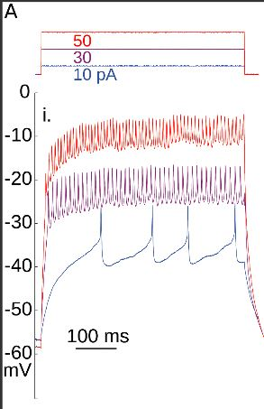
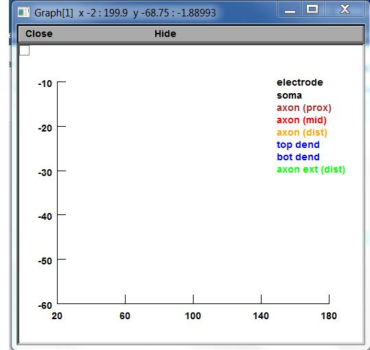
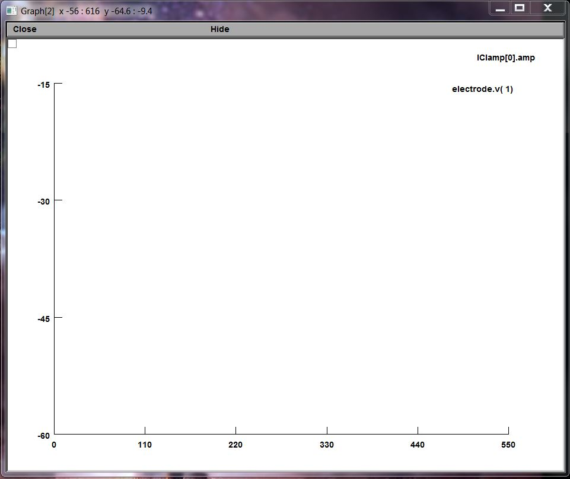
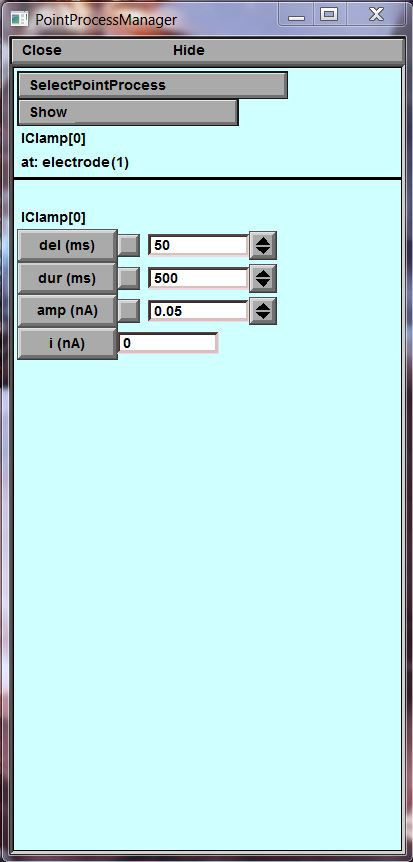
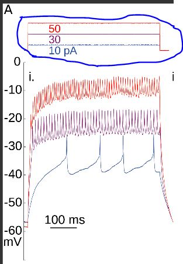
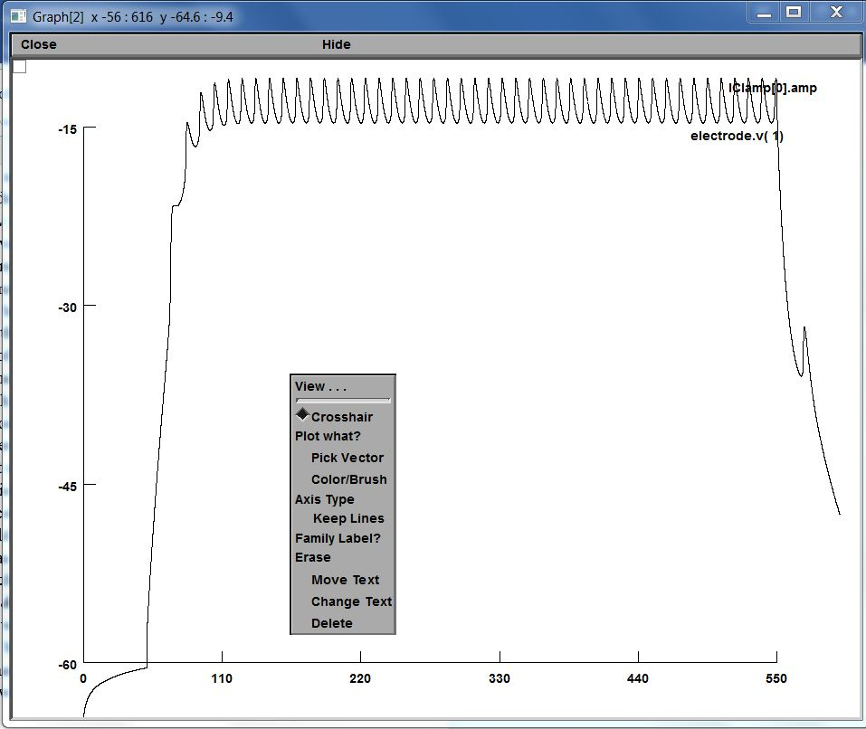

### Morphologically reconstructed model using the Neuron simulator

Prerequisites:

1. Download these files ([latest version](https://github.com/cengique/drosophila-aCC-L3-motoneuron-model/archive/master.zip) 
or the [1.0 stable release](https://github.com/cengique/drosophila-aCC-L3-motoneuron-model/archive/v1.0.zip))
1. Install [NEURON 7.1 or later](http://www.neuron.yale.edu/neuron/)

Run the simulation with:

- In Linux or Mac OS X, on the command line type ```nrngui exp-axon-tail2-chans-ext-axon-70um.ses``` 
- In Windows, right click on `exp-axon-tail2-chans-ext-axon-70um.ses` and open it with Neuron.

Once Neuron loads, click on `Init & Run` on the control window to run a sample simulation. The `IClamp` point process parameters can be adjusted to change input current injected to the soma.

 TUTORIAL
 ==========================
   An important part of this tutorial is the paper titled [Distal Spike Initiation Zone Estimation](http://journals.plos.org/ploscompbiol/article?id=10.1371/journal.pcbi.1004189#pcbi-1004189-g0020), as the point of this tutorial will be to recreate a graph shown in this paper labeled Figure 2 Part A i. The lines of the graph represent the data output, when the researchers changed the current being injected into the model by the simulated IClamp. This data would become more important later in the overall experiment as they used it as a reference point in comparing different neuron models.
   
   
 
 THe neuron model use in the experiment can be downloaded from above
 
 Once the provided model is open there shall be several windows open on the computer, and althougth not mandatory,rearranging the windows is recommended for the sake of efficiency. At the very least the two graphs, the RunControl window, and the 3D model window of the neuron should be visible; the other windows can be minimized.





Now draw your attention to the window with the 3D model.


You should left-click with the mouse over the word _**Show**_. Unlike most programs now, in order to get the desired effect, the button must be held over the wrods rather than just clicked once. With this a small menu should come down, and while still holding the mouse's left button, the mouse should be moved over the word _**Parameters**_. The left button should then be released; when this is done, the window should change, and in the place of the 3D model should be a window with a column of variables and their values.



These variables are the parameters of the Current clamp that is in the 3D model. If you return to the graph in the paper, you will notice that the values of the injected currents are recorded above the graph, with the color of the number corresponding to the line of the same color.



In order to change the current in Neuron, the value of the variable amp(nA) must be changed. One thing that must be noticed is that the units used in the paper are pA while Neuron 7.4 uses the units nA. The p is the abbreviation of the units Pico and the n is the abbreviation of the unit Nano, and in order to convert to units, Nano has to be multiplied by 10^3, and to convert in the opposite direction Pico should be multiplied by 10^-3. When you look in the window with the variables , you will see that nA has already been set to 0.05, and based on the rule of conversion 0.05 nA equals 50 pA which is the top value on the data table. In order to create this graph, you simply need to click the _**Init & Run**_ button in the _**RunControl**_ window.


When this is done there should be lines in graph windows 1 and 2, for this tutorial we will be focusing on _**Graph Window 1**_.


Because we will be adding more lines to the graph we need to make sure that when a new line is drawn the old ones stay there. TO do this you need to click on the graph and hold down the right button of the mouse, at which timea menu should appear.



Do not let go of the button until the cursor is over the _**Keep Lines**_ option. When you let go, Neuron will know from now on to keep all lines created.

TO now create the 30 pA graph, you need to go back to the model parameters window and change the nA from 0.05 to 0.03 and click enter, then hit _**Init & Run**_ button in the _**RunControl**_ window.


